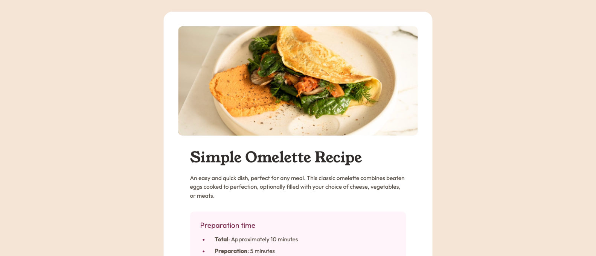
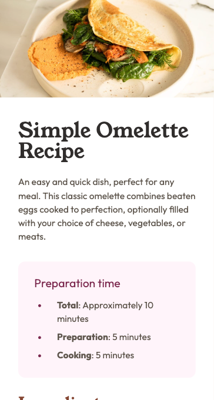

# Frontend Mentor - Recipe page solution

This is a solution to the [Recipe page challenge on Frontend Mentor](https://www.frontendmentor.io/challenges/recipe-page-KiTsR8QQKm). Frontend Mentor challenges help you improve your coding skills by building realistic projects.

## Table of contents

- [Overview](#overview)
  - [The challenge](#the-challenge)
  - [Screenshot](#screenshot)
  - [Links](#links)
- [My process](#my-process)
  - [Built with](#built-with)
  - [What I learned](#what-i-learned)
  - [Continued development](#continued-development)
- [Author](#author)

**Note: Delete this note and update the table of contents based on what sections you keep.**

## Overview

### Screenshot

#### Desktop

#### Mobile

### Links

- Solution URL: https://github.com/stefan-holmgren/fem-recipe-page
- Live Site URL: https://stefan-holmgren.github.io/fem-recipe-page/

## My process

### Built with

- Semantic HTML5 markup
- CSS custom properties
- CSS Grid

### What I learned

I didn't really do a mobile first approach - which perhaps was a mistake.

It took some restructuring to get it to work in both mobile and desktop.

### Continued development

I will try to keep mobile in mind in the future, before going headfirst into the solution.

## Author

- Frontend Mentor - [@stefan-holmgren](https://www.frontendmentor.io/profile/stefan-holmgren)
